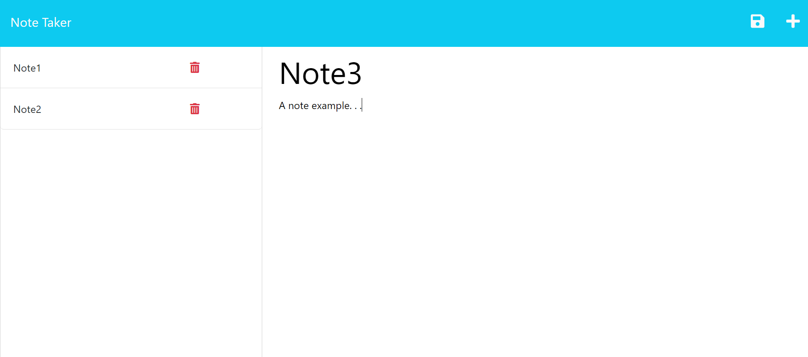

# Note_Taker
Heroku-deployed, note taking app with express.js backend

## Description

Application provides an interface for storing notes. Notes will persist until deleted.

## Usage

Application is deployed at, and can be accessed via, Heroku (see link below).  
Users are presented with a welcome screen. Clicking the Get Started button will open the notes page.
A blanke template fills the main area of the screen where a note title and text body can be added. Clicking the save icon in the upper right of the screen will add the note to the list on the left. A delete button attached to the note can be used to remove the note from the list. Clicking on a note will reopen the note as the main focus. Clicking the '+' button in the upper right will open another blank note template.

This application uses an API interface to pass and return data between the \[express.js\] back and \[HTML/JavaScript\] front ends.

Application can be accessed here:

https://expressjs-notetaker-app.herokuapp.com/

GitHub Repository can be found here:

https://github.com/creechj/Note_Taker

## Credits

Serving static files:  
https://expressjs.com/en/starter/static-files.html

express methods (GET/POST/DELETE):  
https://expressjs.com/en/5x/api.html#app.delete.method

## License

Please see license in repository for this application
